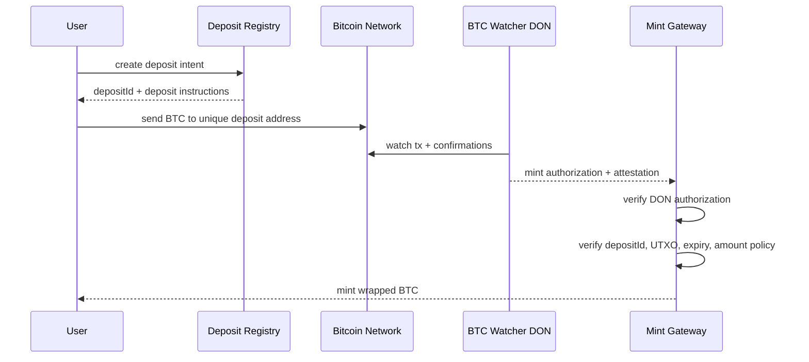
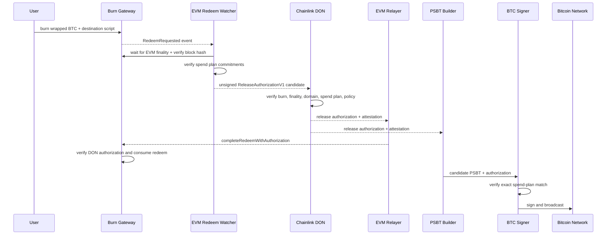

# Flows and Runbooks v1

Status: draft
Date: 2026-04-20

## BTC -> EVM

### Failure Runbook

- Deposit arrives after intent expiry: do not mint automatically; move to manual review or refund flow.
- Deposit seen with insufficient confirmations: keep pending, never pre-authorize.
- Source disagreement on BTC data: pause mint direction if disagreement breaches policy.
- Invalid mint authorization schema or ABI hash: reject before signing or relaying.
- Reorg after tentative observation: invalidate pending authorization and restart observation.
- Duplicate UTXO claim: reject and alert immediately.

## EVM -> BTC

### Failure Runbook

- Signer rejects PSBT mismatch: do not coerce or partially override; rebuild only under the same commitments or request a fresh authorization.
- Broadcast failure for signed tx: retry broadcast of the identical transaction only.
- EVM reorg before signing: invalidate authorization and clear reservation.
- Invalid release authorization: do not mark the redeem consumed and do not send the PSBT to signing.
- Spend-plan commitment mismatch: reject before signing and require a rebuilt PSBT or fresh authorization.
- Watcher restart: resume from persisted SQLite state and never discard observed redeem events.
- Attestation provider restart: resume `authorized` / `attestation_requested` rows and recompute the same authorization digest.
- Relayer restart: resume `attested` / `relayed` rows, reconcile submitted receipts, and avoid re-submitting already consumed redeems.
- Public worker restart: resume `redeem_submitted` rows by receipt hash before resubmitting, and broadcast only after `redeem_completed`.
- Treasury input conflict: stop automation, quarantine the redeem, and require operator review.
- Fee spike above `maxMinerFeeSats`: reject the plan and request a fresh DON authorization with updated policy.

## Shared Incident Rules

- Pause only the affected direction when possible; do not freeze both directions by default.
- Preserve replay stores and authorization logs during incident response.
- Never recycle a consumed `depositId`, `redeemRequestHash`, or `redeemId`.
- Any manual action must produce an audit record tied to the canonical bridge domain and request identifiers.
